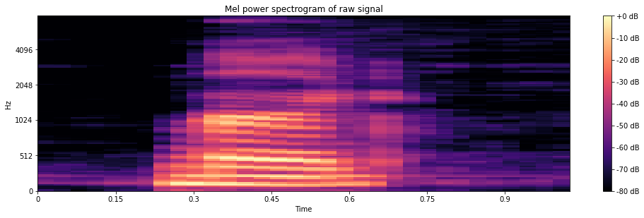

# Speech Commands Recognition
<a href="https://colab.research.google.com/drive/1a2J7kFYN8a5Q0t2A8v7g4JMjzD26R0yN?usp=sharing"></a>
## Overview
This is a simple example of speech recognition using the Google Speech Recognition API. In this notebook, I applied some techniques to visualize audio waveform and augment data. Also, I used a simple CNN model to classify the speech commands since I transformed the audio files into spectrogram images. I will release a deployment version of this (if I have time and motivation) in the future.
  
About the dataset: the Speech Commands has 65,000 one-second long utterances of 30 shorts words, by thousands of different speakers. You can find more information about the dataset [here](https://arxiv.org/pdf/1804.03209v1.pdf).  
  
## Setup
### Install dependencies
```bash
pip install -r requirements.txt
```  
  
### Clone submodule
```bash
git submodule update --init --recursive
```
If the command above is not working, you can use the following to clone the submodule
```bash
rm -rf SpecAugment
git clone https://github.com/thanhtvt/SpecAugment.git
```

### Download the dataset
```bash
wget https://storage.googleapis.com/download.tensorflow.org/data/speech_commands_v0.02.tar.gz
tar -xvzf speech_commands_v0.02.tar.gz
rm speech_commands_v0.02.tar.gz
```

## Model overview
```
----------------------------------------------------------------
        Layer (type)               Output Shape         Param #
================================================================
            Conv2d-1           [-1, 32, 30, 30]             320
       BatchNorm2d-2           [-1, 32, 30, 30]              64
            Conv2d-3           [-1, 64, 28, 28]          18,496
       BatchNorm2d-4           [-1, 64, 28, 28]             128
         MaxPool2d-5           [-1, 64, 14, 14]               0
           Dropout-6           [-1, 64, 14, 14]               0
           Flatten-7                [-1, 12544]               0
            Linear-8                 [-1, 1024]      12,846,080
           Dropout-9                 [-1, 1024]               0
           Linear-10                  [-1, 128]         131,200
          Dropout-11                  [-1, 128]               0
           Linear-12                   [-1, 35]           4,515
================================================================
Total params: 13,000,803
Trainable params: 13,000,803
Non-trainable params: 0
----------------------------------------------------------------
Input size (MB): 0.00
Forward/backward pass size (MB): 1.51
Params size (MB): 49.59
Estimated Total Size (MB): 51.11
----------------------------------------------------------------
```

## Some visualizations
### Waveform & Spectrogram

  
### Mel power spectrogram

  
### MFCC

  
## Prediction results
In the end, my model achieved an accuracy of 79% on the test set (There are many room for improvement since my main purpose is to introduce some visualization techniques). Below is the confusion matrix of my predictions against the ground truth.  
  


## How to improve?
There are many ways to improve the result. Some of them maybe:  
- Tuning the hyperparameters (highly recommend using [wandb.ai](https://wandb.ai/) for this purpose)
- Augmenting the data (e.g. adding noise, adding background noise, adding background music, etc.)
- Adjusting the model (e.g. adding more convolutional layers, adding more fully connected layers, etc.)
- Changing the model architecture (e.g. using RNN instead of CNN, using a more complex model architecture, etc.)
  
## References
- [Simple audio recognition: Recognizing keywords](https://www.tensorflow.org/tutorials/audio/simple_audio)
- [Speech Commands Recognition with Torchaudio](https://pytorch.org/tutorials/intermediate/speech_command_recognition_with_torchaudio.html)
- [LibROSA demo](https://github.com/librosa/librosa/blob/main/examples/LibROSA%20demo.ipynb)
- [Speech representation and data exploration](https://www.kaggle.com/davids1992/speech-representation-and-data-exploration)